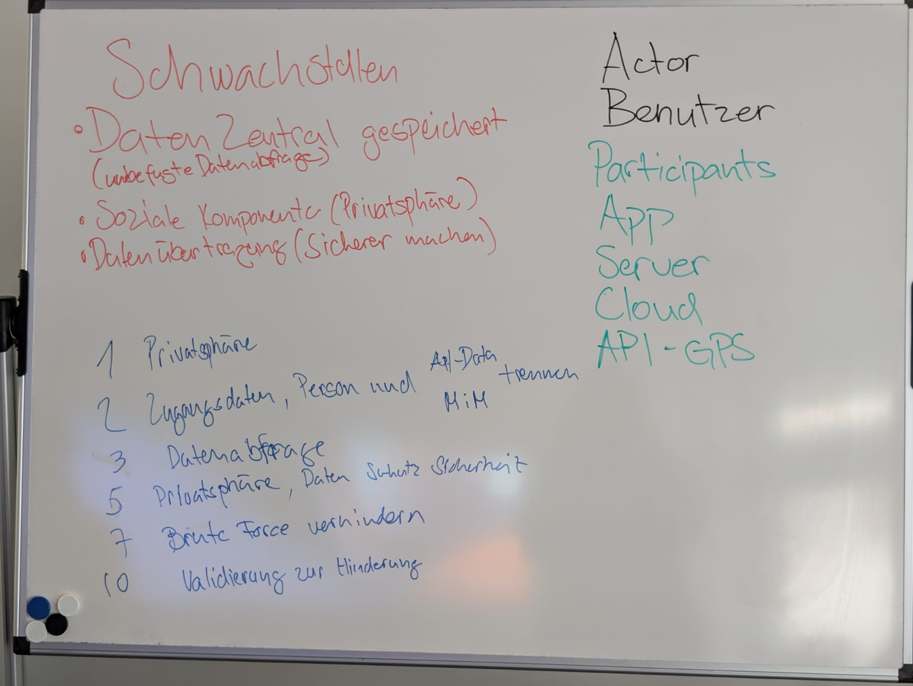
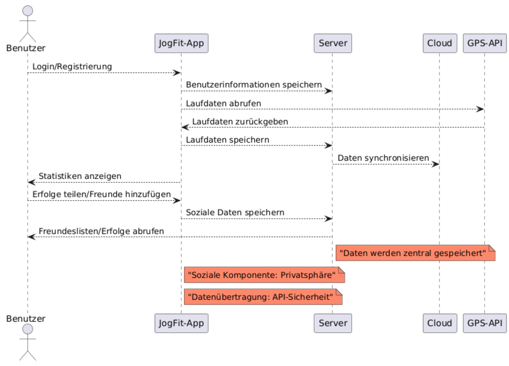
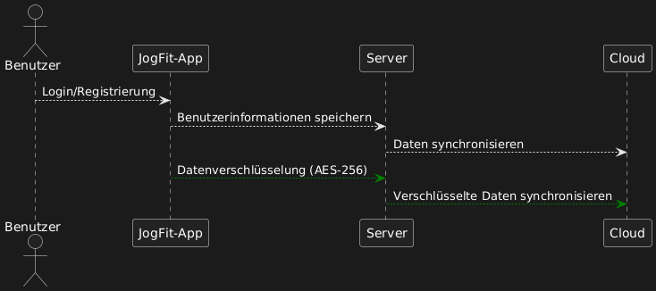
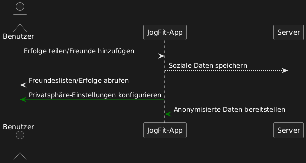
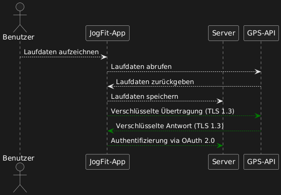
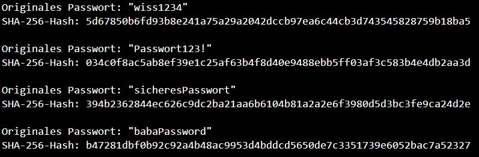
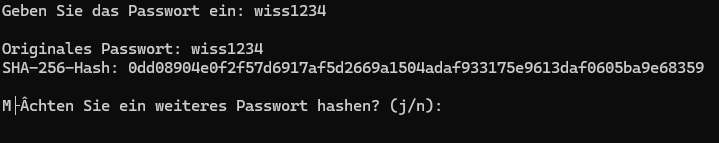

# Projektarbeit_Modul_183

#### Teammitglieder: Mazlum Raimi & Patrik Rossetti

## Vorgehungsweise

- Aufgabe gemeinsam besprochen
- Text gemeinsam Analysiert und Stichworte gemacht
- Text mit erarbeitetem Top10-OwAPS verglichen um mögliche Fehlerquellen zu finden
- Grobe planung des Weiteren vorgehen
- Kochen :)

## Sicherheitskonzept

### Sicherheitskonzept für die JogFit-App

#### Einleitung

Die JogFit-App ist eine moderne Fitness-Anwendung, die Joggern hilft, ihre Leistungen zu verfolgen und soziale Interaktionen zu fördern. Durch Funktionen wie GPS-Tracking, Datenanalyse und soziale Komponenten bietet die App einen hohen Nutzen, birgt jedoch potenzielle Sicherheitsrisiken. Dieses Konzept beschreibt die Sicherheitsanforderungen, analysiert identifizierte Schwachstellen anhand der OWASP Top 10 und schlägt Maßnahmen zur Risikominimierung vor.

### Sicherheitsanforderungen

#### Allgemeine Sicherheitsanforderungen

**Vertraulichkeit:** Schutz der Benutzerdaten vor unbefugtem Zugriff.

**Integrität:** Sicherstellen, dass Daten während der Übertragung oder Speicherung nicht manipuliert werden
.
**Verfügbarkeit:** Gewährleistung, dass die App und ihre Funktionen jederzeit zugänglich sind.

**Transparenz:** Bereitstellung von Informationen über die Datenspeicherung und -nutzung für die Benutzer.

#### Spezifische Sicherheitsanforderungen

**Zugriffskontrolle:** Implementierung von rollenbasierten Berechtigungen.

**Datenverschlüsselung:** Verschlüsselung sensibler Daten sowohl bei der Übertragung als auch bei der Speicherung.

**Sichere API:** Absicherung der Schnittstellen gegen Angriffe wie Injection und Man-in-the-Middle.

**Privatsphäre-Einstellungen:** Benutzerdefinierte Steuerung über die Sichtbarkeit von Daten.

### Identifizierte Sicherheitslücken

#### Zentrale Datenspeicherung

**Beschreibung:** Benutzerdaten und Laufdaten werden zentral auf einem Server gespeichert.

**OWASP-Kategorie:** Sensitive Data Exposure (A02:2021).

**Risiko:** Bei unzureichendem Schutz könnten unbefugte Zugriffe auf sensible Daten erfolgen.

#### Soziale Komponente

**Beschreibung:** Freundeslisten und geteilte Erfolge sind für andere Nutzer sichtbar.

**OWASP-Kategorie:** Broken Access Control (A01:2021).

**Risiko:** Unbefugte Nutzer könnten auf persönliche Daten zugreifen.

#### Datenübertragung und API-Sicherheit

**Beschreibung:** Daten werden zwischen App, GPS-API und Server übertragen.

**OWASP-Kategorie:** Security Misconfiguration (A05:2021).

**Risiko:** Unverschlüsselte oder schlecht konfigurierte Schnittstellen könnten Angriffe wie Man-in-the-Middle ermöglichen.

### Maßnahmen zur Behebung

#### Zentrale Datenspeicherung

**Datenverschlüsselung:** Verschlüsselung sensibler Daten mit AES-256 sowohl bei der Speicherung als auch bei der Übertragung.

**Zugriffsmanagement:** Implementierung des Zero-Trust-Prinzips und rollenbasierter Zugriffsrechte.

**Monitoring:** Einsatz von Echtzeit-Analyse-Tools zur Erkennung unbefugter Zugriffe.

**Dezentralisierung:** Speicherung bestimmter Daten in dezentralen Strukturen, um die Angriffsfläche zu verringern.

#### Soziale Komponente

**Privatsphäre-Einstellungen:** Nutzern die Möglichkeit geben, die Sichtbarkeit ihrer Daten individuell einzustellen.

**Anonymisierung:** Anonymisierung von Nutzerdaten, bevor sie in sozialen Funktionen sichtbar werden.

**Access Logs:** Protokollieren aller Zugriffe auf soziale Daten, um Missbrauch nachzuvollziehen.

#### Datenübertragung und API-Sicherheit

**TLS-Verschlüsselung:** Sicherstellen, dass alle Übertragungen mit TLS 1.3 verschlüsselt sind.

**Sichere Authentifizierung:** Nutzung von OAuth 2.0 für API-Zugriffe.

**Input-Validierung:** Validieren aller Eingaben an die API, um Injection-Angriffe zu verhindern.

**Penetration Tests:** Regelmäßige Sicherheitsüberprüfungen der Schnittstellen.

### Schwachstellen nach OWASP Top 10 identifiziert

| **Schwachstelle**                   | **OWASP-Katergorie**            | **Begründung**                                                             |
| ----------------------------------- | ------------------------------- | -------------------------------------------------------------------------- |
| Zentrale Datenspeicherung           | Sensitive Data Exposure (A02)   | Sensible Daten können bei unzureichender Verschlüsselung exponiert werden. |
| Soziale Komponente                  | Broken Access Control (A01)     | Zugriffskontrollen für persönliche Daten sind unzureichend.                |
| Datenübertragung und API-Sicherheit | Security Misconfiguration (A05) | Fehlerhafte API-Konfiguration ermöglicht potenziell Datenabgriff.          |

Fazit

Durch die Implementierung der beschriebenen Maßnahmen kann die Sicherheit der JogFit-App signifikant verbessert werden. Besonders der Schutz sensibler Daten, die Absicherung der sozialen Funktionen und die Sicherheit der API sind essenziell, um das Vertrauen der Nutzer zu gewährleisten und den Anforderungen moderner Sicherheitsstandards zu entsprechen.

## Erarbeitete Objecte

### 1. Stichwörter aus dem Text



### 2. Ist-PlantUML-Diagramm



```
@startuml

actor Benutzer

participant "JogFit-App" as App
participant "Server" as Server
participant "Cloud" as Cloud
participant "GPS-API" as GPS

' Haupt-Ablauf der App
Benutzer --> App : Login/Registrierung
App --> Server : Benutzerinformationen speichern
App --> GPS : Laufdaten abrufen
GPS --> App : Laufdaten zurückgeben
App --> Server : Laufdaten speichern
Server --> Cloud : Daten synchronisieren
Benutzer <-- App : Statistiken anzeigen

' Soziale Komponente
Benutzer --> App : Erfolge teilen/Freunde hinzufügen
App --> Server : Soziale Daten speichern
Server --> Benutzer : Freundeslisten/Erfolge abrufen

' Schwachstellen visualisieren
note right of Server #FF8600
"Daten werden zentral gespeichert"
end note

note right of App #FF8600
"Soziale Komponente: Privatsphäre"
end note

note right of App #FF8600
"Datenübertragung: API-Sicherheit"
end note

@enduml
```

### 3. Lösungsvorschläge-PlantUML-Diagramme





### 4. Java-PasswordHashing

```
import java.security.MessageDigest;
import java.security.NoSuchAlgorithmException;

public class PasswordHashing {

    // Methode zum Hashen des Passworts mit SHA-256
    public static String hashPassword(String password) {
        try {
            // MessageDigest-Instanz mit SHA-256 initialisieren
            MessageDigest digest = MessageDigest.getInstance("SHA-256");

            // Passwort in Bytes umwandeln und den Hash berechnen
            byte[] hashBytes = digest.digest(password.getBytes());

            // Byte-Array in einen hexadezimalen String umwandeln
            StringBuilder hexString = new StringBuilder();
            for (byte b : hashBytes) {
                String hex = Integer.toHexString(0xff & b);
                if (hex.length() == 1) hexString.append('0');
                hexString.append(hex);
            }
            return hexString.toString();
        } catch (NoSuchAlgorithmException e) {
            throw new RuntimeException("SHA-256 Algorithmus nicht gefunden!", e);
        }
    }

    public static void main(String[] args) {
        // Test-Passwörter
        String[] testPasswords = {"123456", "Passwort123!", "sicheresPasswort", "babaPassword"}; //Hier PW eingeben

        // Passwörter hashen und Ergebnisse anzeigen
        for (String password : testPasswords) {
            String hash = hashPassword(password);
            System.out.println("Originales Passwort: \"" + password + "\"");
            System.out.println("SHA-256-Hash: " + hash);
            System.out.println();
        }
    }
}

```



### 5. Bat PasswordHashing

```
@echo off
:loop
:: Eingabeaufforderung für das Passwort
set /p password=Geben Sie das Passwort ein:

:: Temporäre Datei erstellen
echo %password% > temp_password.txt

:: SHA-256-Hash des Passworts berechnen
for /f "skip=1 tokens=*" %%A in ('certutil -hashfile temp_password.txt SHA256 ^| findstr /v "hash"') do (
    set hash=%%A
)

:: Ergebnis anzeigen
echo.
echo Originales Passwort: %password%
echo SHA-256-Hash: %hash%
echo.

:: Temporäre Datei löschen
del temp_password.txt

:: Benutzer fragen, ob das Programm erneut ausgeführt werden soll
set /p repeat=Möchten Sie ein weiteres Passwort hashen? (j/n):
if /i "%repeat%"=="j" goto loop

echo Programm beendet.
pause

```



## Hilfestellung

1. ChatGpt
2. Folien aus dem Untericht
3. Owasp https://owasp.org/www-project-top-ten/
